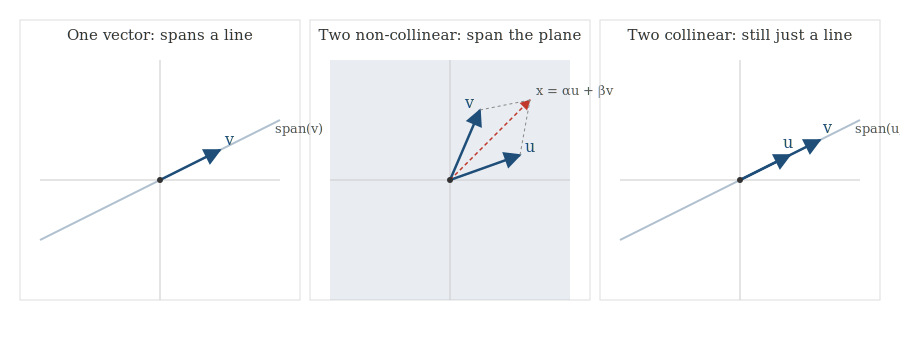
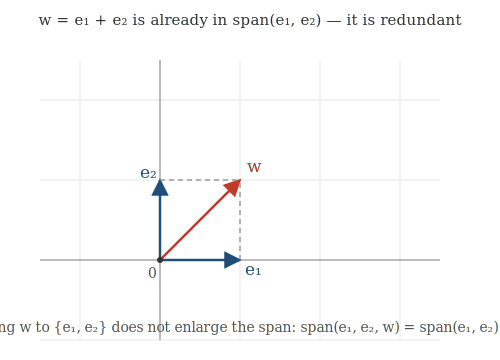
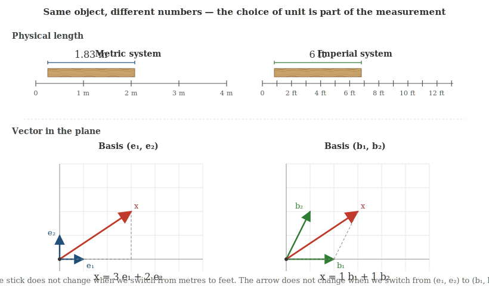
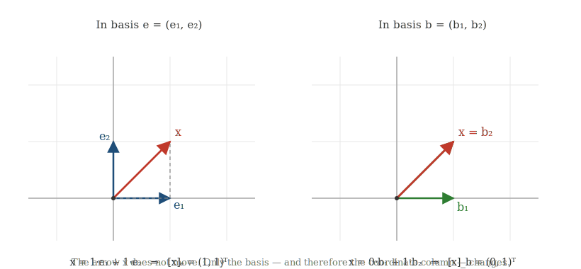
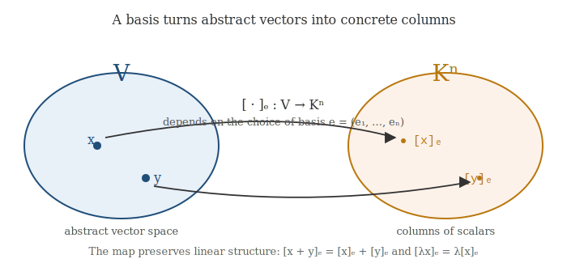

# Linear Span, Basis, and Coordinates

## 1. Linear Span and Generation

### 1.1. What can a few vectors build?

Let $V$ be a vector space over a field $K$. Elements of $V$ are **vectors**, elements of $K$ are **scalars**. The fundamental operation of linear algebra combines them into a **linear combination**

$$\lambda_1 v_1 + \lambda_2 v_2 + \cdots + \lambda_m v_m, \qquad v_i \in V, \ \lambda_i \in K.$$

This raises a natural question: given vectors $v_1, \dots, v_m$, what part of $V$ can we reach by linear combinations alone? The answer is the **linear span**.

### 1.2. Linear span: two views of one object

The **linear span** of $v_1, \dots, v_m \in V$ is the set of all their linear combinations:

$$\operatorname{span}(v_1, \dots, v_m) = \{\lambda_1 v_1 + \cdots + \lambda_m v_m : \lambda_i \in K\}.$$

Two complementary descriptions characterize this set, and both are worth holding in mind:

*From below.* It is closed under addition and scalar multiplication (the sum of two linear combinations of the $v_i$ is again a linear combination of the $v_i$, and so is any scalar multiple). Hence the span is a **vector subspace** of $V$.

*From above.* It is the **smallest subspace of $V$ containing $v_1, \dots, v_m$**. Any subspace containing the $v_i$ must, by closure, contain every linear combination of them; conversely, the set of all such combinations already is a subspace. So the span is exactly the closure of $\{v_1, \dots, v_m\}$ under the operations of linear algebra.

### 1.3. Span in the plane: the geometry

A picture clarifies everything. In $\mathbb{R}^2$:

- A single nonzero vector $v$ spans a **line** through the origin in its direction.
- Two non-collinear vectors $u, v$ span the **entire plane**: every $x \in \mathbb{R}^2$ is $\alpha u + \beta v$ for some unique $\alpha, \beta$.
- Two collinear vectors span only a **line**, regardless of how many we have.

The lesson: what matters is not the *number* of vectors, but whether they contribute genuinely new directions.

### 1.4. Generation and redundancy

We say $v_1, \dots, v_m$ **generate** (or **span**) $V$ if $\operatorname{span}(v_1, \dots, v_m) = V$. A generating system lets us build every vector — but it may do so inefficiently. For instance, in $\mathbb{R}^2$ with $e_1 = (1,0)$, $e_2 = (0,1)$, and $w = (1,1)$:

$$\operatorname{span}(e_1, e_2, w) = \operatorname{span}(e_1, e_2) = \mathbb{R}^2,$$

because $w = e_1 + e_2$ adds nothing new. The vector $w$ is **redundant**.

Redundancy has a price: when generators are redundant, the same vector can be written as a linear combination in many different ways. To get **unique** representations, we need to eliminate redundancy.

### 1.5. Linear independence

The vectors $v_1, \dots, v_m$ are **linearly dependent** if there exist scalars $\lambda_1, \dots, \lambda_m$, not all zero, with

$$\lambda_1 v_1 + \cdots + \lambda_m v_m = 0.$$

They are **linearly independent** if the only such combination yielding zero is the trivial one ($\lambda_1 = \cdots = \lambda_m = 0$).

Dependence is exactly the statement that some vector in the system is a linear combination of the others: if $\lambda_m \neq 0$ in the relation above, then

$$v_m = -\tfrac{\lambda_1}{\lambda_m} v_1 - \cdots - \tfrac{\lambda_{m-1}}{\lambda_m} v_{m-1}.$$

So *independence means every vector contributes something the others cannot produce.*

### 1.6. Basis

A **basis** of $V$ is a system $e = (e_1, \dots, e_n)$ that is both a generating system and linearly independent. Equivalently, a basis is:

- a *minimal* generating system (drop any vector and it no longer spans), or
- a *maximal* linearly independent system (add any vector and it becomes dependent).

The payoff is the theorem that makes the rest of the subject possible:

> **If $e = (e_1, \dots, e_n)$ is a basis of $V$, then every $x \in V$ can be written as $x = x_1 e_1 + \cdots + x_n e_n$ in exactly one way.**

Existence comes from generation; uniqueness comes from independence. A basis is therefore the *right* notion: large enough to describe everything, small enough to describe it unambiguously.

---

## 2. Dimension and Examples of Bases

### 2.1. Dimension

If $V$ has a basis of $n$ vectors, then $V$ is **$n$-dimensional**, written $\dim V = n$. A central theorem (which we will not prove here) guarantees this is well-defined: every basis of $V$ has the same number of vectors. Dimension is a property of the space itself, not of any particular basis.

### 2.2. Three standard examples

**Coordinate space $K^n$.** The standard basis is

$$e_1 = (1, 0, \dots, 0), \quad e_2 = (0, 1, \dots, 0), \quad \dots, \quad e_n = (0, 0, \dots, 1),$$

so $\dim K^n = n$. Every $x = (x_1, \dots, x_n)$ is $x_1 e_1 + \cdots + x_n e_n$. The basis is so embedded in the notation that we usually forget it is there — a habit we will need to break shortly.

**Matrices $$\operatorname{Mat}_{m \times n}(K)$$.** The matrix units $E_{ij}$ (one in position $(i,j)$, zero elsewhere) form a basis. Every matrix is the sum of its entries times the corresponding $E_{ij}$, so $$\dim \operatorname{Mat}_{m \times n}(K) = mn$$.

**Polynomials $K_{\leq n}[t]$.** The monomials $1, t, t^2, \dots, t^n$ form a basis, so $\dim K_{\leq n}[t] = n + 1$. But this is far from the only choice: the shifted basis $1,\ t-1,\ (t-1)^2,\ \dots,\ (t-1)^n$ also spans and is independent, and is more convenient for studying polynomials near $t = 1$.

### 2.3. Natural vs. chosen bases

Some spaces come with a basis built into their definition: $K^n$, $$\operatorname{Mat}_{m\times n}(K)$$, $K_{\leq n}[t]$. Others do not.

The geometric plane is the cleanest case. Its vectors are arrows — magnitude and direction — with no built-in coordinates. To do calculations we must *choose* two non-collinear vectors $u, v$ to serve as a basis. Different choices give different descriptions of the same arrow.

**An analogy from physics.** This situation is exactly the one we face when measuring a physical quantity. Consider a stick lying on a table. The stick has a definite length — this is a physical fact, independent of human convention. But to *report* its length numerically, we must first choose a unit. In the metric system the stick might be $1.83$ metres long; in the imperial system the same stick is $6$ feet long. Both numbers describe the same stick, and neither is more correct than the other. They differ because the underlying *unit of length* is different.

A basis plays exactly the same role for vectors. The vector itself — the arrow on the plane — exists independently of any coordinate system, just as the stick exists independently of metres or feet. To say "this vector has coordinates $(5, 4)$" presupposes a choice of two unit vectors that play the role of "one tick in each direction." Choose a different pair of unit vectors, and the same arrow has different coordinates, just as the same stick yields different numbers in metres and feet.

| | physical length | vector in the plane |
|---|---|---|
| **the object** | a stick on the table | an arrow |
| **the choice** | unit (metre or foot) | basis $(e_1, e_2)$ |
| **the number(s)** | $1.83$ or $6$ | coordinates $(x_1, x_2)$ |
| **what changes if we change the choice** | the number | the coordinates |
| **what does not change** | the stick | the arrow |

The lesson is the same in both cases. Spaces of functions, spaces of solutions to differential equations, and many others all share this property with the geometric plane: many useful bases, no preferred one.

This is where the central conceptual distinction of linear algebra emerges. A vector is one thing; its description in a basis is another.

---

## 3. Coordinates: Vectors vs. Their Descriptions

### 3.1. Coordinates require a basis

Fix a basis $e = (e_1, \dots, e_n)$ of $V$. Every $x \in V$ has a unique expansion $x = x_1 e_1 + \cdots + x_n e_n$, and the scalars $x_1, \dots, x_n$ are the **coordinates** of $x$ in the basis $e$. We collect them into the **coordinate column**

$$[x]_e = \begin{pmatrix} x_1 \\ \vdots \\ x_n \end{pmatrix} \in K^n.$$

The notation matters. $x$ is an element of $V$; $[x]_e$ is a column of scalars. They live in different worlds. A useful analogy: a vector is like a house, and its coordinates are like its street address. The house exists regardless of how the city numbers its streets. Renumber the streets and the address changes — but the house has not moved.

### 3.2. The same vector, different coordinates

Take $V = \mathbb{R}^2$ and $x = (1, 1)$.

In the standard basis $e_1 = (1, 0),\ e_2 = (0, 1)$, we have $x = 1 \cdot e_1 + 1 \cdot e_2$, so

$$[x]_e = \begin{pmatrix} 1 \\ 1 \end{pmatrix}.$$

In the basis $b_1 = (1, 0),\ b_2 = (1, 1)$, the same vector is $x = 0 \cdot b_1 + 1 \cdot b_2$, so

$$[x]_b = \begin{pmatrix} 0 \\ 1 \end{pmatrix}.$$

The arrow has not moved. Only the basis changed, and with it the coordinate description.

### 3.3. The same column, different vectors

The reverse is just as important. The column

$$\begin{pmatrix} 1 \\ 2 \end{pmatrix}$$

is **not a vector** on its own — it is a recipe. The recipe says: *take one copy of the first basis vector and two copies of the second.* Applied in different bases or different spaces, it produces entirely different objects:

| Basis / Space | Vector produced |
|---|---|
| $(e_1, e_2)$ in $\mathbb{R}^2$ | $e_1 + 2 e_2 = (1, 2)$ |
| $(1, t)$ in $K_{\leq 1}[t]$ | the polynomial $1 + 2t$ |
| $(1, i)$ in $\mathbb{C}$ over $\mathbb{R}$ | the complex number $1 + 2i$ |
| $(f_1, f_2)$ in a solution space | the function $f_1 + 2f_2$ |

Without a basis, the column has no object to act on.

### 3.4. The coordinate map

Choosing a basis $e$ defines a map

$$[\,\cdot\,]_e : V \to K^n, \qquad x \mapsto [x]_e,$$

which translates between abstract vectors and concrete columns. This translation respects the linear structure: if $x, y \in V$ and $\lambda \in K$, then

$$[x + y]_e = [x]_e + [y]_e, \qquad [\lambda x]_e = \lambda [x]_e.$$

Both identities follow immediately from the definition: writing $x$ and $y$ as combinations of the $e_i$ and adding coefficient-by-coefficient produces the corresponding column equality. So once a basis is chosen, calculations in $V$ become calculations on columns in $K^n$.

### 3.5. The central distinction

We can now state the conceptual point cleanly.

> A vector is an element of a vector space. Coordinates are scalars that describe that vector relative to a chosen basis. They are not the same object.

The same vector has different coordinate columns in different bases. The same coordinate column represents different vectors in different bases or different spaces. A vector does not need coordinates to exist; coordinates are how we calculate with vectors numerically once a basis has been fixed.

This distinction is the bridge to everything that follows. With bases chosen, vectors become columns, linear maps become matrices, and a change of basis becomes a change of coordinate system. Underneath, the geometric objects remain unchanged. The coordinates are just the language we use to describe them.


