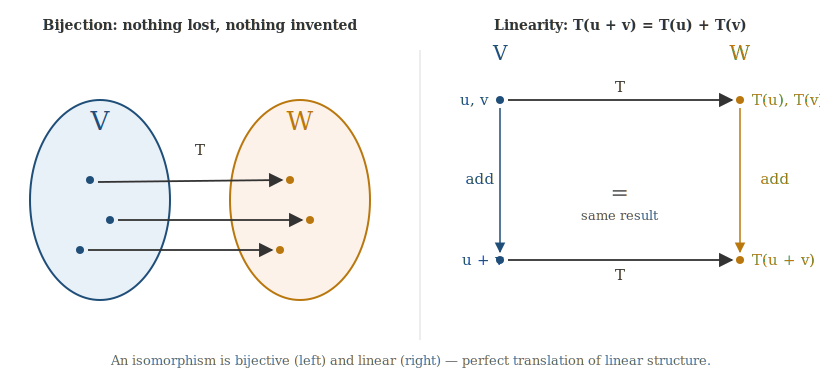
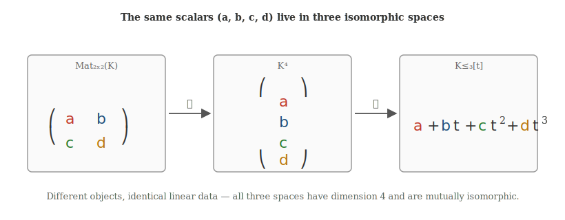
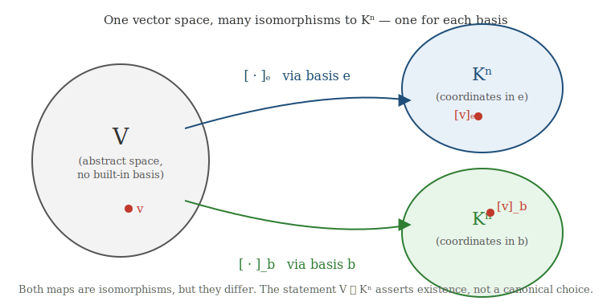

# Isomorphism of Vector Spaces

## 1. The motivating question

The vector spaces of linear algebra contain very different-looking objects. Consider three spaces over a field $K$:

$$K^4 \ni \begin{pmatrix} a \\ b \\ c \\ d \end{pmatrix}, \qquad \operatorname{Mat}_{2\times 2}(K) \ni \begin{pmatrix} a & b \\ c & d \end{pmatrix}, \qquad K_{\leq 3}[t] \ni a + bt + ct^2 + dt^3.$$

A column, a matrix, and a polynomial are not the same kind of object. Yet each is determined by four independent scalars, each space has dimension $4$, and the operations of addition and scalar multiplication behave identically in all three. From the standpoint of linear structure, the three spaces are interchangeable.

The word for "interchangeable as vector spaces" is **isomorphic**.

---

## 2. Definition

Let $V$ and $W$ be vector spaces over the same field $K$. A map $T : V \to W$ is an **isomorphism of vector spaces** if it is

1. **linear**: $T(u + v) = T(u) + T(v)$ and $T(\lambda v) = \lambda T(v)$ for all $u, v \in V$, $\lambda \in K$;
2. **bijective**: every $w \in W$ is hit by exactly one $v \in V$.

When such a $T$ exists we write $V \simeq W$ and say $V$ and $W$ are isomorphic.

Linearity is the algebraic content of the diagram on the left: adding first and then mapping gives the same result as mapping first and then adding. Bijectivity guarantees that no information is lost or invented in translation.

Because an isomorphism preserves the two basic operations, it preserves everything built from them — linear combinations, linear independence, spans, bases, and dimension. If $v_1, \dots, v_n$ is a basis of $V$, then $T(v_1), \dots, T(v_n)$ is a basis of $W$.

A crucial point of vocabulary: $V \simeq W$ does **not** mean $V = W$. Equality means the two spaces are literally the same set of objects. Isomorphism means they have the same linear architecture, even when their elements look entirely different.

---

## 3. A concrete example

Define $$T : \operatorname{Mat}_{2\times 2}(K) \to K_{\leq 3}[t]$$ by

$$T\!\begin{pmatrix} a & b \\ c & d \end{pmatrix} = a + bt + ct^2 + dt^3.$$

This map is linear (adding matrices or scaling them produces the corresponding operation on coefficients) and bijective (every polynomial of degree at most $3$ comes from exactly one matrix). So matrices and polynomials are interchangeable as vector spaces, even though a matrix is plainly not a polynomial.

The same scalars $(a, b, c, d)$ also produce a column in $K^4$. All three representations carry the same linear data:

---

## 4. Bases produce isomorphisms with $K^n$

The single most important source of isomorphisms is the coordinate map. Let $\dim V = n$ and choose a basis $e = (e_1, \dots, e_n)$. Every $v \in V$ has a unique expansion $v = x_1 e_1 + \cdots + x_n e_n$, giving the map

$$[\,\cdot\,]_e : V \to K^n, \qquad v \mapsto \begin{pmatrix} x_1 \\ \vdots \\ x_n \end{pmatrix}.$$

This map is linear by the calculation of §3.4 in the previous chapter, and it is bijective: surjective because the basis spans $V$, injective because the basis is independent (different vectors cannot have the same coordinate column). So $[\,\cdot\,]_e$ is an isomorphism, and

$$V \simeq K^n.$$

Two consequences follow at once. First, any two $n$-dimensional vector spaces $V$ and $W$ over $K$ are isomorphic: pick bases on each side, and the map

$$V \xrightarrow{\ [\,\cdot\,]_e\ } K^n \xrightarrow{\ \Phi_f\ } W$$

(where $\Phi_f$ sends a column $(x_1, \dots, x_n)$ to $x_1 f_1 + \cdots + x_n f_n$) is an isomorphism. Second, the converse holds too: isomorphic spaces must have the same dimension, because isomorphisms send bases to bases.

This gives the classification theorem.

> **Theorem.** Two finite-dimensional vector spaces over the same field $K$ are isomorphic if and only if they have the same dimension.

So up to isomorphism, $K^n$ is the **only** $n$-dimensional vector space over $K$.

---

## 5. The isomorphism $V \simeq K^n$ depends on a choice of basis

The classification theorem comes with a subtle point that needs to be stated clearly. The isomorphism $V \simeq K^n$ exists, but it is not unique. Each basis of $V$ produces a different coordinate map, and hence a different isomorphism.

For an abstract vector space like the geometric plane, no basis is preferred. There are infinitely many isomorphisms $V \to \mathbb{R}^2$, none of them more correct than the others. The statement $V \simeq \mathbb{R}^2$ asserts existence, not a particular choice.

This is the difference between **canonical** and **non-canonical** isomorphism. A canonical isomorphism is one that requires no arbitrary choice — it is determined by the spaces themselves. A non-canonical isomorphism requires extra data, such as a basis.

The coordinate isomorphism $V \simeq K^n$ is the prototypical *non-canonical* isomorphism: changing the basis changes the map.

---

## 6. An example of a canonical isomorphism

To see what canonical means concretely, consider the swap map between two products. Let $V$ and $W$ be any vector spaces over $K$, and form the product spaces $V \times W$ and $W \times V$. Define

$$\sigma : V \times W \to W \times V, \qquad \sigma(v, w) = (w, v).$$

This is linear and bijective, so it is an isomorphism. And the construction never appealed to a basis of $V$ or $W$ — it used only the product structure, which is given by the spaces themselves. The map $\sigma$ is therefore **canonical**: it is the same map regardless of any choices we might later make inside $V$ or $W$.

Compare this with the coordinate isomorphism. To produce $K^2 \to K^2$ that swaps the two coordinates, we relied on the fact that $K^2$ already comes with a standard basis. For an abstract two-dimensional space, "swap the two coordinates" is meaningless until we pick which coordinates we mean. The swap of $V \times W$, by contrast, is meaningful from the start.

A useful slogan:

> *Isomorphic* means structurally the same. *Canonically isomorphic* means structurally the same in a choice-free way.

(Another standard example, important in more advanced linear algebra, is the canonical isomorphism $V \to V^{**}$ between a finite-dimensional space and its double dual, given by $v \mapsto (\varphi \mapsto \varphi(v))$. No basis is chosen in writing this down.)

---

## 7. A warning: vector-space isomorphism is not algebra isomorphism

Some vector spaces carry additional operations. Matrices can be multiplied; polynomials can be multiplied; complex numbers can be multiplied. An isomorphism of *vector spaces* is required to respect only addition and scalar multiplication. It need not respect any extra multiplication.

The canonical example is $\mathbb{C}$ viewed as a real vector space. The map

$$a + bi \mapsto \begin{pmatrix} a \\ b \end{pmatrix}$$

is an isomorphism $\mathbb{C} \simeq \mathbb{R}^2$ of real vector spaces. But complex multiplication

$$(a + bi)(c + di) = (ac - bd) + (ad + bc)i$$

does not match componentwise multiplication $(a, b) \cdot (c, d) = (ac, bd)$ on $\mathbb{R}^2$. So $\mathbb{C}$ and $\mathbb{R}^2$ are isomorphic as vector spaces but inequivalent as algebras: there is more structure in $\mathbb{C}$ than the linear isomorphism captures.

The general lesson: always ask which operations the isomorphism is required to preserve. "Isomorphic" is meaningful only relative to a specified structure.

---

## 8. Summary

A finite-dimensional vector space over $K$ is, from the viewpoint of linear algebra alone, determined by its dimension. Whatever its elements look like — arrows, matrices, polynomials, functions, complex numbers — a basis turns them into coordinate columns and identifies the space with $K^n$. That identification is non-canonical, depending on the basis chosen, but its existence is what makes abstract linear algebra computational.

When extra structure is present (multiplication, an inner product, an ordering), isomorphism must be reinterpreted to account for it. And when an isomorphism arises without any choice — like the swap of a product space — it deserves the special label *canonical*, reflecting that it belongs to the spaces themselves rather than to a coordinate system imposed on them.


